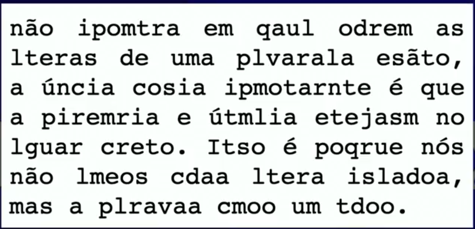

# Tipografia

## Anatomia do Tipo

Tipo é como cada uma das letras é desenhada

`
A letra 'x' é o ponto de partida para a contrução das fontes, por conta da metrica altura 'x' que define qual vai ser a altura basica de todas as minusculas de uma familia de fontes
`

### Itens Metricos


### Anatomicos

#### Anatomico Gemetrico

**Serifa** cria uma linha imaginria que o nosso cerebro percebe


exemplo de um texto com serifa, desorganizao mais mesmo assim conseguimos ler



## Familia de Fontes

```css
   body{
        font-family: 'Times New Roman';
    }
```

### CSS Web safe combinations

 é uma forma de combinar fontes semelhates para que quando uma não for encontrada possa ser usada outra semelhante

```css
   body{
        font-family:Arial, Helvetica, sans-serif;
    }
```

### Forma Generica

O brwoser vai se encarregar de escolher a fonte padrão para cada um dos tipos

```css
body{
font-famaly: sans-serif;
font-famaly: serif;
font-famaly: monospace;
}
```

## Tamanhos de Fontes

### Medidas Absolutas

+ cm
+ mm
+ in(Polegada)
+ px
+ pt(Ponto)
+ pc(Paica)

pt, pc - não se recomenda em material que vai ser impresso em tela digital

### Medidas Relativas

+ em (medida relativa ao tamanho padrão da fonte 16px)
+ ex (relativo a altura 'x' de uma fonte)
+ rem (relativo ao root a font configurada no body)
+ vw (largura da viewport)
+ vh (altura da viewport)
+ %

```css
* {
    font-size: 1.5em ;
    font-size: 16px;
}
```

## Peso de Fontes

Usado para colocar  a font em negrito

### Pesos Literais

+ lighter
+ normal
+ bold
+ bolder

### Pesos Numericos

Vão de 100 - 900
100 - lighter
400 - normal
800 - bolder

```css
* {
    font-weight: lighter;
    font-weight: 100;
}
```

## Estilo de Fontes

Usado para colocar  a font em italic

```css
* {
    font-style: italic;
    font-style: normal;
}
```

Usado para colocar  a font em sublinhada

```css
* {
    text-decoration: underline;
}
```

## shorthand font

è uma forma mais enchuta de escrever CSS difinindo varios atributos

Ordem:
1. font-style
2. font-weight
3. font-size
4. font-family


```css
* {
    font-family: Arial;
    font-weight: bold;
    font-style: italic;
    font-size: 3em;
   
}
```

shorthand

```css
* {
    font: italic bolder 3em Arial, sans-serif;
}
```

## Fontes Baixadas
site para baixar fontes [dafont](dafont.com)

para colocar uma fonte baixada no site usasse    um font-face personalizado

```css
 @font-face {
    font-family: nome_da_font;
    src: url('arquivo.format') format(tipo_de_format);
    
    /*mais de uma url*/
    src: url('arquivo1.format') format(tipo_de_format), url('arquivo2.format') format(tipo_de_format);

    font-weight: normal;
    font-style: normal;

    /*
        Tipos de format()
        - opentype (otf)
        - truetype (ttf)
        - embedded-opentype
        - truetype-aat (Apple Advanced Typography)
        - svg
    */
}
* {
font-family: nome_font_face;
}
```

## Capturando as Fontes usadas em um Site

extenção 

Fonts Ninja

## Alinhamento de Texto


```css
* {
    font : normal 16px "Helvetica Neue", verdana, serif;
    text-align : center;    
    text-align : left;    
    text-align : right;    
    text-align : justify;   
    
    text-indent : 30px; /* da um espaçamento inicial na primeira linha(abrir paragrafo) */
}
```