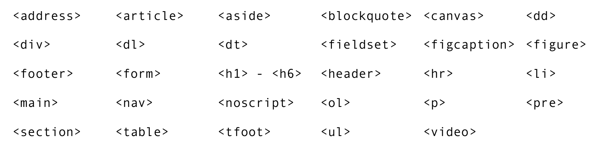

# Modelo de Caixas

## Anatomia de Caixas
colocar uma caixa dentro de outra é chama de aninhameno


## Tipos de caixa
### box-level


#### Tags box-level


### inline-level


#### Tags inline-level


podemos transfotmar o display de um objeto inline para block e vice versa ou ainda em um inline-block que fica com as propreidades de ambos

### SHORTHAND


`width e height são o box-sizi`
  

### Borda arrendoda
```css

    * {
        border-radius: 5px;
        border-radius: 50%;
    }

```