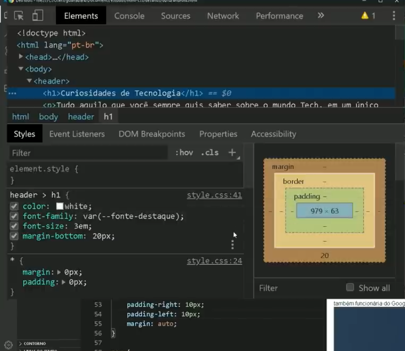
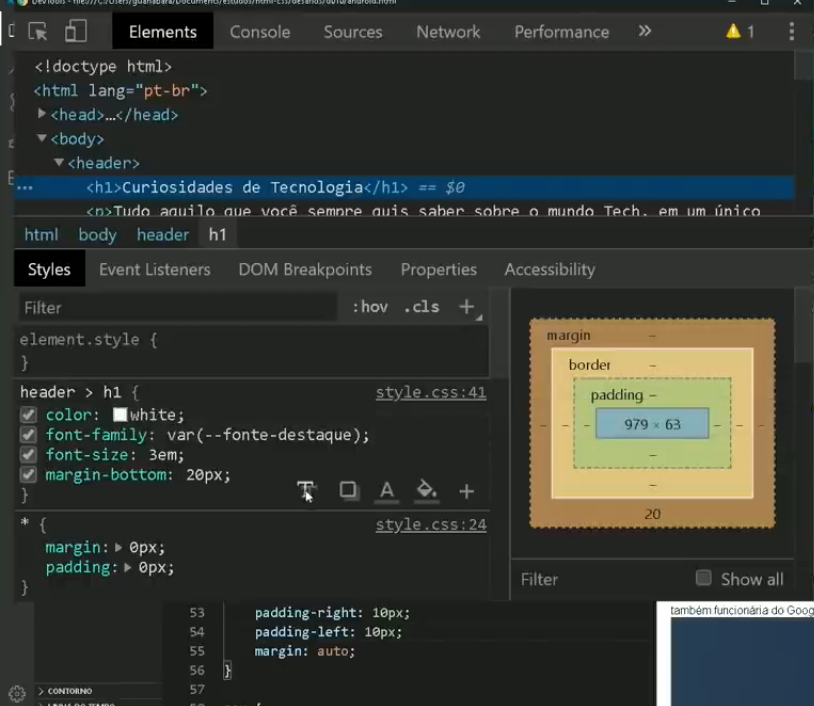
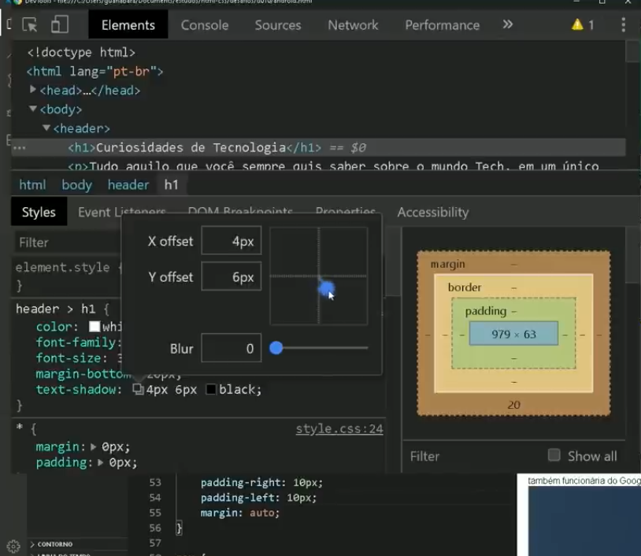

# Variavei em CSS

Para criar as variveis em css usamos a pseudo-class :root
```css
:root{
    --cor0: #c5ebd6;
    --cor1: #83e1ad;
    --cor2: #3ddc84;
    --cor3: #2fa866;
    --cor4: #1a5c37;
    --cor5: #063d1e;
}

```

# Responsividade
Significa adaptar o conteudodo site a varias resoluções de dispositivos diferentes 

# Usar o devTools do chrome para criar sombras
  

  

  

